<p align="center">
  
</p>

<h1 align="center">NovaPay FraudGuard</h1>

<p align="center">
  <strong>AI-powered real-time fraud detection for digital payments</strong>
</p>

<p align="center">
  Detect suspicious transactions in milliseconds, reduce false positives, explain model decisions, and deliver fraud intelligence through a production-style machine learning system.
</p>

<p align="center">
  
  
  
  
  
  
</p>

---

## Table of Contents

- [Project Overview](#project-overview)
- [Business Problem](#business-problem)
- [Why This Project Matters](#why-this-project-matters)
- [Project Objectives](#project-objectives)
- [Solution Architecture](#solution-architecture)
- [Dataset](#dataset)
- [Exploratory Data Analysis](#exploratory-data-analysis)
- [Key Fraud Insights](#key-fraud-insights)
- [Machine Learning Approach](#machine-learning-approach)
- [Model Performance](#model-performance)
- [Explainability](#explainability)
- [Application and Deployment](#application-and-deployment)
- [Dashboard Features](#dashboard-features)
- [Project Structure](#project-structure)
- [Installation and Local Setup](#installation-and-local-setup)
- [API Usage](#api-usage)
- [Cloud Deployment](#cloud-deployment)
- [Limitations](#limitations)
- [Future Improvements](#future-improvements)
- [Skills Demonstrated](#skills-demonstrated)
- [Author](#author)

---

## Project Overview

**NovaPay FraudGuard** is an end-to-end machine learning system designed to detect fraudulent digital-payment transactions in real time.

The project replaces a traditional static, rules-based fraud process with an adaptive model that learns from transaction behaviour, payment channels, device signals, customer history, geographic information, account characteristics, and transaction velocity.

The solution goes beyond training a classifier. It demonstrates the full journey from raw transaction data to a usable fraud-prevention product:

> Data preparation → exploratory analysis → feature engineering → time-based validation → model tuning → explainability → FastAPI → Docker → Streamlit dashboard

NovaPay FraudGuard is built to support two important decisions:

1. **Should this transaction be allowed to proceed?**
2. **What signals caused the transaction to be considered risky?**

---

## Business Problem

Digital payment fraud changes rapidly. Fraudsters adapt their behaviour, devices, locations, payment channels, and transaction patterns to avoid detection.

Static rules can identify known patterns, but they often struggle when fraud tactics change, transaction volumes increase, fraud patterns differ across channels and countries, genuine customers behave unusually, or too many legitimate transactions are incorrectly blocked.

This creates two costly outcomes:

### Missed fraud

Fraudulent transactions that are approved can lead to:

- Direct financial losses
- Chargebacks and refunds
- Higher investigation costs
- Regulatory exposure
- Loss of customer trust

### False positives

Legitimate transactions incorrectly flagged as fraud can lead to:

- Payment delays
- Customer frustration
- Abandoned transactions
- Higher support costs
- Reduced customer retention

NovaPay therefore needs a fraud-detection system that is **accurate, explainable, scalable, and fast enough for real-time payment decisions**.

---

## Why This Project Matters

Fraud detection is not simply a classification task. It is a business trade-off between security and customer experience.

A useful model must:

- Catch as much fraud as possible
- Avoid unnecessarily blocking legitimate users
- Prioritise high-risk cases for investigation
- Explain why a transaction was flagged
- Remain reliable as fraud patterns change
- Deliver predictions through a production-ready interface

NovaPay FraudGuard addresses these requirements through a tuned LightGBM model, time-aware validation, SHAP explainability, a FastAPI prediction service, Docker packaging, and a Streamlit monitoring dashboard.

---

## Project Objectives

- Clean, validate, and prepare transaction data for reliable analysis and modelling
- Explore transaction behaviour and identify patterns associated with fraud
- Engineer meaningful behavioural, temporal, geographic, and risk features
- Handle the class imbalance between legitimate and fraudulent transactions
- Compare multiple classification algorithms
- Select and tune the strongest model using fraud-relevant metrics
- Validate the final model using a chronological train-test split
- Reduce false positives while maintaining strong fraud recall
- Explain global and transaction-level model decisions using SHAP
- Expose the trained model through a FastAPI prediction endpoint
- Package the backend service with Docker
- Build an interactive Streamlit dashboard for monitoring and live scoring

---

## Solution Architecture

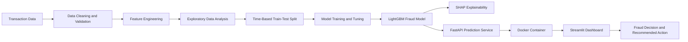

### Production request flow

```text
User enters transaction details
            ↓
Streamlit sends a POST request
            ↓
FastAPI validates and transforms the request
            ↓
Saved LightGBM pipeline generates a probability
            ↓
API returns fraud prediction and risk score
            ↓
Dashboard displays the decision and recommended action
```

---

## Dataset

The cleaned dataset contains:

- **11,140 transactions**
- **10,147 legitimate transactions**
- **993 fraudulent transactions**
- **8.91% overall fraud rate**

### Main feature groups

| Feature group | Example variables |
|---|---|
| Transaction information | Transaction amount, source amount, fee, exchange rate |
| Currency information | Source currency, destination currency, currency corridor |
| Customer profile | Account age, KYC tier, chargeback history |
| Device intelligence | New device indicator, device trust score |
| Geographic risk | Home country, IP country, location mismatch |
| Network and risk signals | IP risk score, corridor risk, internal risk score |
| Behavioural velocity | Transactions in the previous hour and 24 hours |
| Time features | Year, month, hour, day of week, weekend and night indicators |
| Target | `is_fraud` |

```text
0 = Legitimate transaction
1 = Fraudulent transaction
```

Because the target is imbalanced, accuracy alone is not sufficient. Precision, recall, F1 score, the confusion matrix, and PR-AUC are more meaningful.

---

## Exploratory Data Analysis

### 1. Transaction class distribution

<p align="center">
  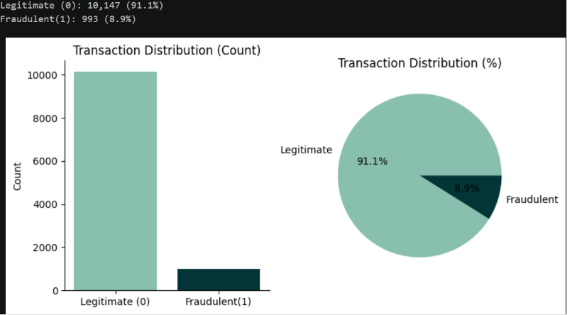
</p>

Fraud represents **8.9%** of the transactions. This imbalance means a model could achieve high accuracy by predicting most transactions as legitimate while still missing important fraud cases.

### 2. Annual fraud-rate trend

<p align="center">
  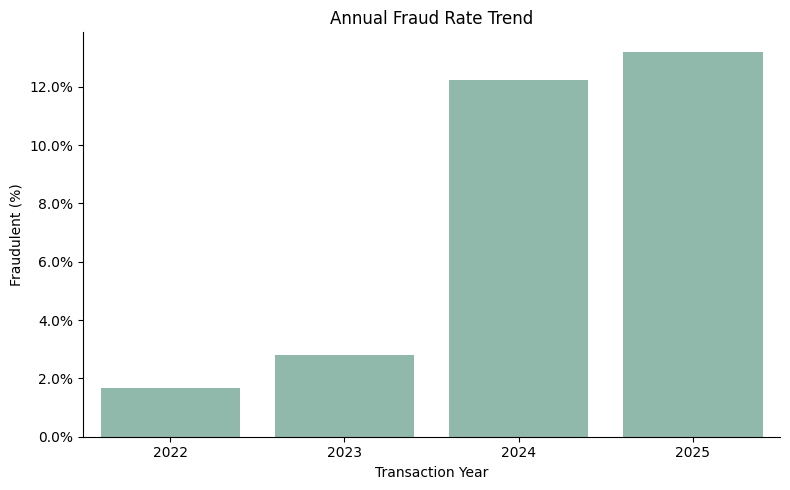
</p>

The annual fraud rate increased substantially in 2024 and 2025 compared with 2022 and 2023. This supports the decision to use chronological validation.

### 3. Financial exposure

<p align="center">
  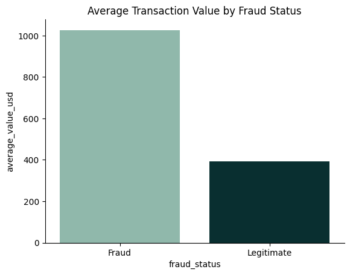
</p>

Fraudulent transactions have a much higher average value than legitimate transactions, meaning a smaller number of fraud events may create disproportionate financial losses.

<p align="center">
  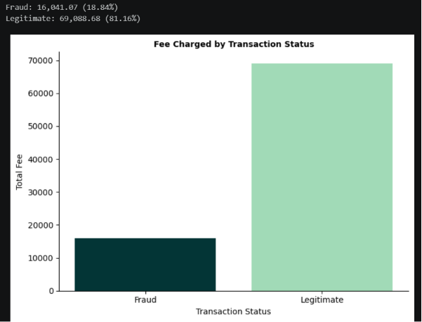
</p>

### 4. Fraud by transaction amount band

<p align="center">
  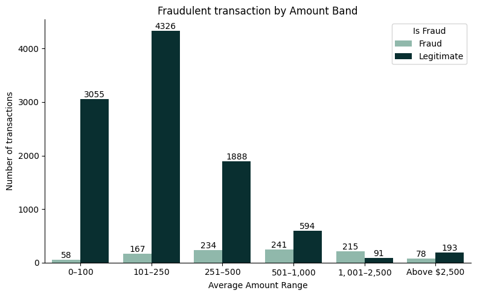
</p>

Fraud appears across multiple amount bands, but larger transaction bands contain a much higher concentration of fraud relative to their legitimate volume.

### 5. Fraud rate by channel

<p align="center">
  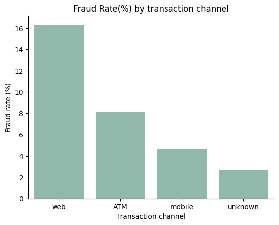
</p>

The **web channel** recorded the highest fraud rate, followed by ATM and mobile transactions.

### 6. Location mismatch

<p align="center">
  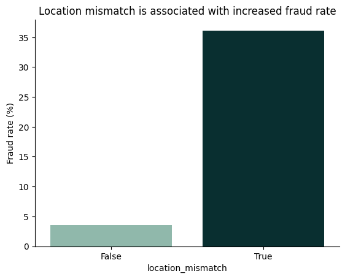
</p>

Transactions with a location mismatch show a dramatically higher fraud rate than transactions without a mismatch.

### 7. Geographic concentration

<p align="center">
  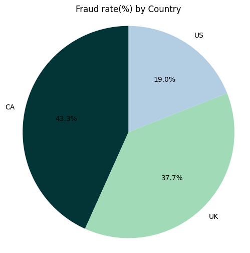
</p>

Fraud cases are not distributed evenly across the home-country groups shown.

### 8. High-risk currency corridors

<p align="center">
  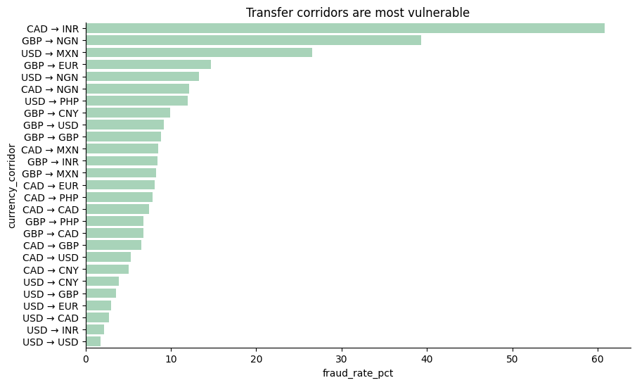
</p>

The most vulnerable routes in the analysed data include **CAD → INR**, **GBP → NGN**, and **USD → MXN**. Corridor rates should be interpreted together with transaction counts.

### 9. Device trust

<p align="center">
  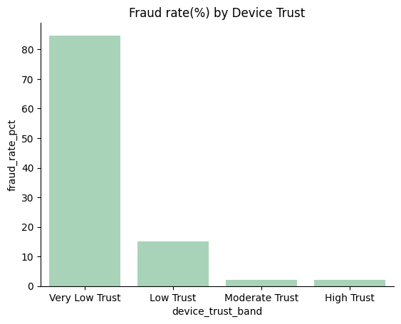
</p>

Transactions from very low-trust devices recorded dramatically higher fraud rates.

### 10. KYC tier

<p align="center">
  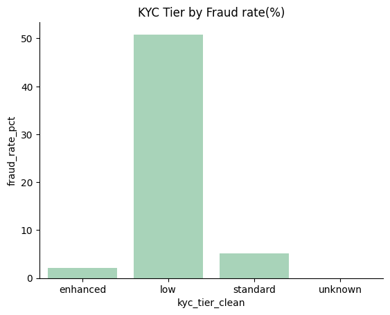
</p>

Low-KYC customers showed the highest fraud rate, while enhanced verification was associated with lower exposure.

### 11. Account age

<p align="center">
  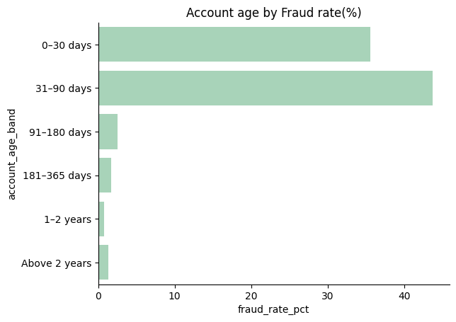
</p>

Newer accounts, particularly those between **0 and 90 days old**, showed much greater fraud exposure.

### 12. Transaction velocity

<p align="center">
  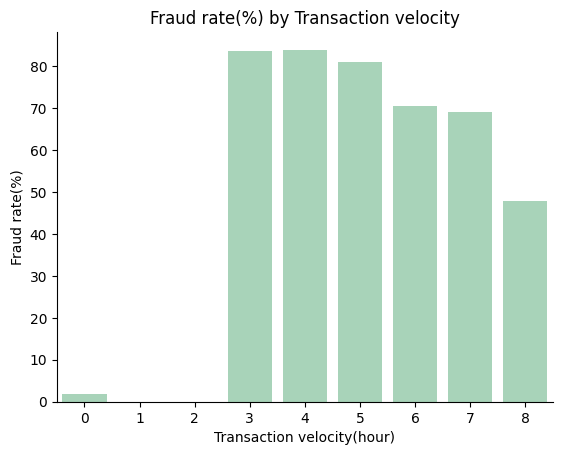
</p>

Repeated activity within a short period was strongly associated with fraud.

### 13. Fraud by day and hour

<p align="center">
  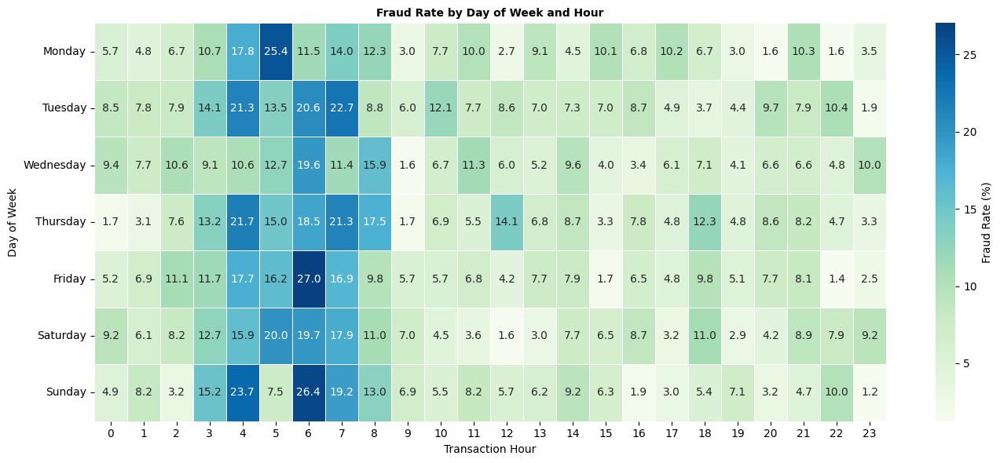
</p>

Fraud risk varied by day of week and transaction hour, with several early-morning periods showing elevated risk.

### 14. Monthly fraud-rate spike

<p align="center">
  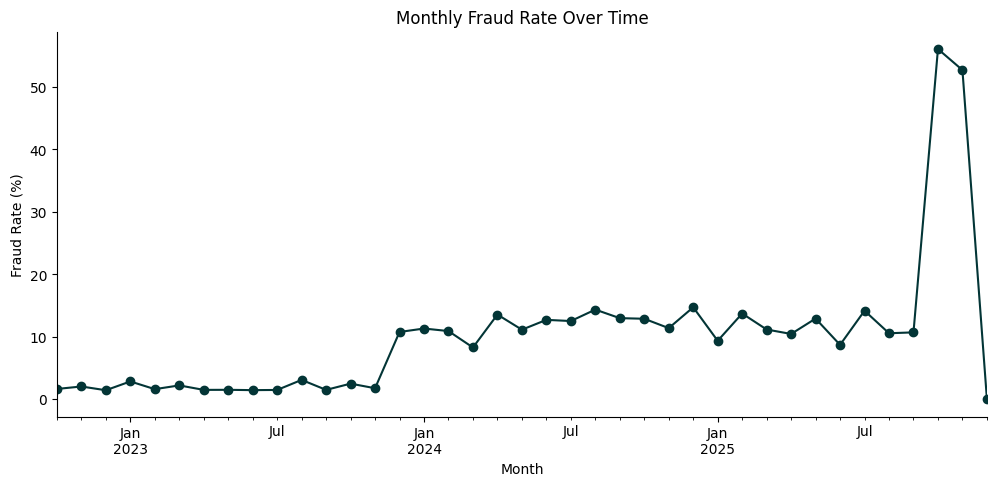
</p>

The monthly trend shows a sharp spike near the end of 2025, confirming the importance of monitoring, drift detection, and periodic retraining.

---

## Key Fraud Insights

1. **Fraud increased over time.** The fraud rate rose sharply in 2024 and 2025.
2. **Fraudulent transactions are financially larger.**
3. **Web transactions carry the highest channel risk.**
4. **Location mismatch is a major warning signal.**
5. **Low device trust is strongly associated with fraud.**
6. **New accounts are more vulnerable.**
7. **Low KYC verification is high risk.**
8. **High transaction velocity is suspicious.**
9. **Risk varies by currency corridor.**
10. **Fraud has strong temporal patterns.**

---

## Machine Learning Approach

### Data preparation

- Correcting inconsistent categorical labels
- Handling missing values
- Converting timestamps to datetime
- Removing non-useful identifiers
- Validating numerical data types
- Creating cleaned feature aliases
- Encoding categorical variables
- Preserving the feature order used during training

### Feature engineering

- Transaction year, month, hour, and day of week
- Weekend and night-transaction indicators
- Transaction amount bands
- Account-age bands
- Device-trust bands
- Currency corridors
- Location mismatch
- New-device indicator
- One-hour and 24-hour transaction velocity
- IP risk score
- Corridor risk
- Internal risk score
- Chargeback history

### Time-based validation

```text
Training period:
3 October 2022 → 23 March 2025

Testing period:
23 March 2025 → 16 December 2025
```

This mirrors deployment more realistically: train on historical transactions and evaluate on future transactions.

### Models evaluated

- Gradient Boosting
- AdaBoost
- XGBoost
- LightGBM
- CatBoost

A tuned **LightGBM** model was selected as the final model.

### Class imbalance

The pipeline used imbalance-aware methods, including SMOTE on the training data only, to help the model learn the minority fraud class without contaminating the test set.

---

## Model Performance

| Metric | Score |
|---|---:|
| PR-AUC | **0.9617** |
| Fraud precision | **0.996** |
| Fraud recall | **0.916** |
| Fraud F1 score | **0.954** |
| Approximate overall accuracy | **98.8%** |

### Confusion matrix

|  | Predicted Legitimate | Predicted Fraud |
|---|---:|---:|
| **Actual Legitimate** | 1,918 | 1 |
| **Actual Fraud** | 26 | 283 |

### Business interpretation

- **283 fraudulent transactions were correctly identified**
- **26 fraudulent transactions were missed**
- **Only 1 legitimate transaction was incorrectly flagged**
- The model caught approximately **92% of fraud cases**
- The very low false-positive count suggests limited disruption to legitimate customers in this test set

PR-AUC was prioritised because it focuses on performance for the positive fraud class and is more informative than accuracy in an imbalanced problem.

---

## Explainability

SHAP was used to understand global model behaviour and individual transaction predictions.

Important fraud drivers included:

- `txn_velocity_1h`
- `txn_velocity_24h`
- `risk_score_internal`
- `channel_web`
- `ip_risk_score`
- Device trust
- Location mismatch
- Account age
- KYC tier
- Corridor risk

Outputs included SHAP bar, beeswarm, and waterfall plots.

---

## Application and Deployment

### FastAPI backend

Main endpoints:

```text
GET  /
GET  /health
POST /predict
GET  /docs
```

### Docker

Docker packages the Python runtime, FastAPI application, model files, feature-name file, libraries, and Uvicorn server.

### Streamlit

The Streamlit application provides:

- Executive fraud monitoring
- Live transaction scoring
- Fraud intelligence charts
- Model-performance reporting
- Dataset-field detection
- API connection monitoring
- Risk decisions and recommended actions

---

## Dashboard Features

### Executive Overview

- Total transactions
- Fraudulent transactions
- Fraud rate
- Total transaction value
- Amount lost to fraud
- Monthly fraud-rate trend
- Transaction distribution
- Fraud rate by channel
- Transaction value by fraud status
- Recent transaction activity

### Live Fraud Scoring

Inputs include transaction amount, payment channel, velocity, IP risk, device trust, new-device status, and location mismatch.

Outputs include:

- Fraud or legitimate prediction
- Fraud probability
- Risk classification
- Recommended action

### Fraud Intelligence

Fraud patterns across channels, home countries, and time.

### Model Performance

PR-AUC, precision, recall, F1 score, performance chart, and confusion matrix.

---

## Project Structure

```text
NovaPay-FraudGuard/
├── api/
│   ├── __init__.py
│   └── main.py
├── dashboard/
│   └── app.py
├── data/
│   └── data_cleaned.csv
├── model/
│   ├── novapay_lightgb_pipeline.pkl
│   └── novapay_feature_names.pkl
├── notebook/
│   └── notebook.ipynb
├── assets/
│   └── EDA images
├── Dockerfile
├── requirements.txt
├── image.png
└── README.md
```

---

## Installation and Local Setup

### Clone the repository

```bash
git clone https://github.com/YOUR-USERNAME/YOUR-REPOSITORY.git
cd YOUR-REPOSITORY
```

### Create a virtual environment

```bash
python -m venv .venv
```

Windows:

```bash
.venv\Scripts\activate
```

macOS/Linux:

```bash
source .venv/bin/activate
```

### Install dependencies

```bash
python -m pip install --upgrade pip
pip install -r requirements.txt
```

### Run FastAPI

```bash
uvicorn api.main:app --reload
```

Open:

```text
http://127.0.0.1:8000/docs
```

### Run Streamlit

```bash
python -m streamlit run dashboard/app.py
```

Open:

```text
http://localhost:8501
```

---

## Run with Docker

```bash
docker build -t novapay-fraud-api .
docker run -p 8000:8000 novapay-fraud-api
```

Health check:

```text
http://127.0.0.1:8000/health
```

Expected response:

```json
{
  "status": "API is running",
  "model_loaded": true
}
```

---

## API Usage

### Endpoint

```text
POST /predict
```

### Example request

```json
{
  "amount_usd": 500,
  "txn_velocity_1h": 3,
  "txn_velocity_24h": 10,
  "ip_risk_score": 0.7,
  "device_trust_score": 0.3,
  "new_device": 1,
  "location_mismatch": 1,
  "channel": "web"
}
```

### Example response

```json
{
  "prediction": "Fraud",
  "fraud_probability": 0.9342
}
```

---

## Cloud Deployment

```text
Streamlit Community Cloud
            ↓
Public FastAPI backend
            ↓
Docker container
            ↓
Saved LightGBM model
```

The dashboard can read the backend URL from an environment variable:

```python
API_URL = os.getenv(
    "API_URL",
    "http://127.0.0.1:8000"
)
```

---

## Limitations

- The dataset represents a project scenario and may not capture every real-world fraud pattern
- Some category-level rates may be influenced by small transaction counts
- Confirmed fraud labels may arrive with delays
- Fraud behaviour changes over time
- The live scoring form collects a subset of all possible raw features
- Strong test results do not remove the need for human review and monitoring
- A real deployment would require stronger privacy, security, encryption, and access controls

---

## Future Improvements

- Automated data- and concept-drift monitoring
- Analyst feedback and case-management workflow
- Cost-sensitive threshold optimisation
- Expected-loss scoring
- Customer behavioural sequences
- Graph features linking accounts, devices, IPs, and beneficiaries
- API authentication and rate limiting
- Managed cloud deployment
- Automated tests and CI/CD
- Scheduled model retraining
- Benchmarking against a documented rules-based baseline

---

## Responsible AI Considerations

- Do not treat nationality, country, or payment corridor as proof of fraud
- Use geographic features only with behavioural and transaction evidence
- Monitor false positives across customer groups
- Provide human review for high-impact decisions
- Record model versions and explanations
- Protect customer data
- Reassess performance when fraud patterns change

The objective is not simply to block more transactions. It is to improve security while protecting legitimate customers from unnecessary friction.

---

## Skills Demonstrated

### Data science and machine learning

- Data cleaning and validation
- Exploratory analysis
- Feature engineering
- Imbalanced classification
- Time-based validation
- Ensemble model comparison
- Hyperparameter tuning
- Precision, recall, F1, PR-AUC, and confusion-matrix analysis
- SHAP explainability

### Software and deployment

- FastAPI
- Uvicorn
- Docker
- Streamlit
- REST API integration
- Joblib model serialisation
- Cloud-ready configuration

### Fraud and fintech analytics

- Payment fraud analysis
- Transaction velocity
- Device risk
- Geographic mismatch
- KYC risk
- Cross-border corridors
- Fraud-operations trade-offs

---

## Author

**Uchechukwu Eze**  
Data Scientist | Machine Learning | Economics | AI for Financial Services

- GitHub: [uchechukwueze](https://github.com/uchechukwueze)
- LinkedIn: www.linkedin.com/in/uchechukwueze


---

## Acknowledgements

This project demonstrates how machine learning, explainability, APIs, containerisation, and interactive dashboards can be combined to address real world fraud risk in digital payments.

---

<p align="center">
  <strong>NovaPay FraudGuard</strong><br>
  Intelligent fraud prevention for safer digital payments.
</p>
